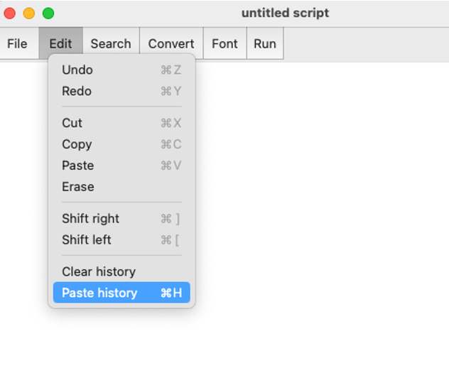

## Overview 
Praat is an acoustic analysis program and programming language developed by Paul Boersma and David Weenink. Praat is best-known for its ability to visualize, label, and segment audio files, perform spectral and temporal analyses of audio, as well as synthesize and manipulate speech. The program is quite powerful and can even do machine learning and experiment building; the programming language is also highly convenient to know, particularly for automating Praat processes at scale.

Learning Praat, the programming language, has many of the same benefits that programming languages offer. Namely, you can easily process large amounts of data, minimize human error (consistency in application), allow others to repeat the process identically (replicability), easily correct mistakes, and flexibly modify your procedure. You might also be asking yourself, why should I learn to write a script from scratch, when I can just modify other people's Praat code? Honestly, knowing how to do this will give you much greater power, control, and flexibility over your own research directions. Becoming independent so you can perfect the methodology that will answer your specific research question is an incredible asset. 

For this tutorial, I will assume that you have basic familiarity with how to analyze sound files and TextGrids through the the **Objects** window. This is Praat's Graphical User Interface (GUI; pronounced *gooey*); Praat scripting conveniently automates the sequence of scripts and processing you would otherwise have to do by hand in this interface. Besides the main Praat website, there are several [great resources](https://www.fon.hum.uva.nl/praat/manualsByOthers.html){target="_blank"} to gain familiarity with the program. Many of the resources also contain further information on Praat scripting.

This tutorial aims to introduce you to a very formulaic, but relatively foolproof approach to Praat scripting in order to automate standard procedures of file creation or manipulation and phonetic measurement. It involves thinking very clearly about what your input files will be and what your output files will contain. The three primary goals of the tutorial are as follows:

+ Write Praat scripts quickly, effectively, and "from scratch"
+ Learn the syntax and structure of the language
+ Handle various input/output combinations

In addition, the primary philosophy I want you to keep in mind while learning to script is: "Script first for yourself, then for others". The goal here is to be able to write an effective, functioning script from scratch. Perhaps it's not the most elegant script, but the goal is to first get it up and running. 

The tutorial is divided into two parts: The Grammar of Praat, where we learn about the fundamentals of how the language works and Active Scripting, where we learn how some key concepts while actively writing Praat code. 

If interested, you can download the corresponding slides and some practice data here: [[new slides]](https://eleanorchodroff.com/PraatScriptingLabPhon.pdf){target="_blank"} [[new slides and data]](https://eleanorchodroff.com/praat_scripting_tutorial.zip){target="_blank"} [[old slides]](https://eleanorchodroff.com/tutorial/PraatScripting2019.pdf){target="_blank"}

## The Grammar of Praat

### Almost everything is a mouse click!
Praat is a GUI scripting language. **GUI = Graphical User Interface, i.e., the Objects window.** If you ever get lost while writing a Praat script, click through the steps using the GUI.

#### How to open a Praat script

+ From the toolbar, select Praat, then New Praat script
+ Save immediately!
+ Save frequently!
+ To run the script, choose Run -> Run

<center>
{#id .class width=40% height=50%}
</center>

<center>
{#id .class width=40% height=50%}
</center>


#### Cheat with Paste history

In your new Praat script, click on the Edit menu, then Paste history. If you haven't done anything in Praat yet, you'll probably just see the line "New Praat script". That's actually the command you would write in a Praat script to create a new Praat script. (Eek, that's a bit too recursive for me.)

<center>
{#id .class width=50% height=50%}
</center>


<br>**Practice:** Let's try a better example with Paste history. Using your normal methods, open up a wav file, then resample the wav file to 4000 Hz with precision set to 50 samples. Now go back to the Praat script and type Paste history. These are the actual commands you would put in your Praat script to automate that process.<br>


#### Commands and arguments

Did you notice how the "Paste history" cheat took the name of the menu option for `Resample...` and wrote it as `Resample: ` followed by two numbers separated by a comma? Most of the Praat GUI menu options can be straightforwardly converted into Praat commands (or functions) in this manner. The `...` that is displayed in the Objects window becomes a colon followed by a space `: `, and the input values to the command are each of the boxes on the interactive screen. 

<center>
{#id .class width=25% height=50%}
</center>

To get a full example of how to convert different input options in Praat's interactive screen to a scripting format, let's try extracting part of a sound file using `Extract part...`. This has two numeric inputs, one dropdown menu, and one checkbox. For the numeric (or string) inputs, you just put in the number (or string), for the dropdown menu, you just write the option you want in quotes, and for the checkbox, you'll write "yes" or "no".  

```{r eval = F}
Extract part: 0, 0.1, “rectangular”, 1.0, “no”
```

<center>
{#id .class width=40% height=50%}
</center>


<br>**Practice:** Write a script that extracts seconds 2 to 10. Scale the intensity to 65 dB (check under Modify menu). Make sure the wav file is selected before hitting “Run”.<br>


#### Selecting objects

When writing a Praat script, again, (almost) everything is a mouse click. This means that you need to instruct Praat to click on the individual files, which we'll call objects in the Objects window. When you're working with the GUI, you know that you've selected an object when it's highlighted in blue. Recall that when an object is selected, you'll get a new set of menu options associated with it. Clicking on a TextGrid pulls up one set of options, and clicking on a sound file brings up a different set. You have to do the same thing when scripting. Funnily enough, when you run a Praat script, you can sometimes see Praat moving through the steps and selecting certain objects (turning them blue), then deselecting them and so forth. 

The primary objects you'll encounter in Praat are:

+ TextGrid object
+ Sound object
+ Strings object
+ Formant object
+ Pitch object

You can use the following commands to navigate the selection, deselection, and removal of objects:

+ selectObject: "TextGrid vowels"
+ plusObject: "Sound vowels"
+ select all
+ minusObject: "Strings files"
+ Remove

<center>
{#id .class width=40% height=50%}
</center>


<br>**Practice:** Write a script that selects a sound file and a TextGrid and removes them both.


### Variables

**Variable:** a labeled container for storing information that can change

Variables in Praat can store numbers or strings (sequences of characters)

+ String variables
+ Numeric variables

General constraints on variables in Praat: 

+ All variables must start with a lower-case letter
+ Define variables with equal sign (x = 5)
+ Refer to variables as arguments directly (x = Get total duration)


#### String variables

+ Name ends with $
+ Defined by quotes or the output of a command
+ Example: file$ = "formants.txt"

```{r eval = F}
dir$ = "/Users/Eleanor/mydir/data/"
filename$ = Get string: i
label$ = Get label of interval: 2, 100
```

#### Numeric variables

+ Name does not have $
+ Example: value = 15

```{r eval = F}
dB = 60.82234
myTotal = 150
nFiles = Get number of strings
intensity = Get intensity (dB)
```

#### Literals

**Literals:** values that do not change but can be assigned to a variable (the storage container)

String literals go in quotes: “formants.txt”

Numeric literals are just numbers: 15, 64.5666


<br>**Practice:** Assign your favorite animal to a variable. Pause the script and display the value of this variable in the pause statement. To pause the script you can use the following command:

```{r eval = F}
pauseScript: “my message”
pauseScript: animal$
pauseScript: phon$, tab$, dur
```

#### String concatenation and truncation

You can add (paste) string variables or strings together with "+" or remove parts of strings using "-". If you want to add a numeric variable to a string variable, you first have to convert the number to a string. You can [read more about string concatenation and relevant operators here](https://www.fon.hum.uva.nl/praat/manual/Formulas_3__Operators.html){target="_blank"}.

```{r eval = F}
dir$ = "/Users/eleanor/Desktop/corpus/"
filename$ = "sent1.wav"
basename$ = filename$ - ".wav"
Read from file: dir$ + basename$ + ".wav"
```


<br>**Practice:** Add your favorite animal variable to the string "My favorite animals are " and store this in a new variable called `animal_message$`. Don't forget the space!

Add your favorite number variable to the string "My favorite number is " and store this in a new variable called `number_message$`. Pause the script and display the values of these two variables in the pause message. You will need to coerce the numeric variable to a string variable before adding it to the existing string using: ``string$(numeric_variable)``.<br>

#### Math

You can also do all types of math on numeric variables or numbers. Praat has built in functions for addition (`+`), subtraction (`-`), multiplication (`*`), division (`/`), exponentiation (`^`), and comparison (`<`, `>`, `<=`, `>=`). You can [read more about the mathematical and logical operators here](https://www.fon.hum.uva.nl/praat/manual/Formulas_3__Operators.html){target="_blank"}.

```{r eval = F}
Addition (+)
Subtraction (-)
Multiplication (*)
Division (/)
Exponentiation (^)
Comparison (<, >, <=, >=)
Among many others
```

<br>**Practice:** Create a variable with the value of 2. Update the variable by multiplying it by 100. Update the variable again by dividing it by 5. Then exponeniate it by a power of 3. Pause the script and display the values of this variable in the pause message.<br>

#### Comments and whitespace

Comments can be added to the beginning of a line with a `#`. You cannot add comments midline like you can in some other programming languages. 

Praat is not particularly whitespace-sensitive; however, it does require a space after the colon of a command. Otherwise, I still find that it is good practice to use standard indentation and spacing to make it easier to read the script. I generally use one tab to indent after a for loop or if-else statement, for example. I also use spaces after each colon and comma, as well as a space before and after the equals sign. 

### For loops

For loops iterate from a start value to an end value and complete some set of instructions. In Praat, you must open and close for loops with a `for` statement at the beginning and an `endfor` statement at the end. The for loop therefore has three parts: 

+ the header with a loop counter and specified end (for i in 1 to nFiles)
+ the body of the for loop that is implemented once per iteration
+ the footer (endfor)

```{r eval = F}
for file in 1 to 15
  do some stuff
endfor

for file in 3 to 15
  do some stuff
endfor

nFiles = 10
for i in 1 to nFiles
  do some stuff
endfor
```

<br>**Practice:** Display 5 pause messages that say "the for loop is on iteration number i", where the iteration is specified in i. (For example, on pause message 3, it should say "the for loop is on iteration number 3".) For example, on pause message 3, it should say "the for loop is on iteration number 3". You will need to coerce (type coercion) the numeric variable to a string variable before adding it to the existing string using ``string$(numeric_variable)``.<br>


### Paths

Paths are a very important part of the general computer experience, especially when it comes to programming. A path is effectively a computer address and is the location of a file or set of files on the computer. One of the main reasons we might turn to Praat scripting is because we have a long series of files to process in the exact same manner. You can point Praat to where those files are located on your computer using a path saved to a string variable.

For example, if all of the files to process are on my Desktop in a folder called "speech_corpus", then I can do the following to have Praat look at that folder and make a list of all the TextGrids (or wav files) in that corpus. This results in a `Strings object` that I have called "Strings files" (first argument to Create Strings as file list command). 


**Path:** a computer address, a location of a file or set of files on the computer

```{r eval = F}
# on a Mac:
path$ = "/Users/eleanor/Desktop/speech_corpus/"

# on a PC:
path$ = "C:/Users/eleanor/Desktop/speech_corpus/"

# Create list of files in a folder:
path$ = "/Users/eleanor/Desktop/speech_corpus/"
Create Strings as file list: "files", path$ + "*.TextGrid”

# This results in a Strings object in the Objects window
```

On Macs, you can drag the folder into the script and it will automatically paste its path. You can also use the following code to select a directory. I don't love this approach as you then have to reselect the directory every time you run the script (and if you're writing it from scratch, you might end up re-running it a lot before you get it right). 

```{r eval = F}
path$ = chooseDirectory$: ”Choose a directory” 
path$ = path$ + “/”
# Add slash at the end with string concatenation
# (The slash is very important when reading in files)
```

<br>**Practice: ** Locate the path to the downloaded speech corpus. Use the following command to create a list of TextGrids in that path:
``Create Strings as file list: “name_of_object”, path$ + “*.TextGrid”``
Get value number 3 from the Strings list and store this in a variable. (Click on Strings object and look under the Query command.) Pause the script and display this value.<br>

### If-else statements

If-else statements are as they sound: they direct the script to do one thing if a certain condition is met, and another thing in the else case. In Praat this is done as follows:

```{r eval = F}
if label$ == "THE"
  # do stuff
else
  # do other stuff
endif
```

Just like with for loops, you have to open and close if-else statements. Two additional notes: you do not need an explicit else statement if you just want the script to move on if the main condition is not met. Also, you can add further conditions with `elsif` statements like the following:

```{r eval = F}
if label$ == "THE"
  # do stuff
elsif label$ == "THAT"
  # do other stuff
else
  # third way of doing stuff
endif

if label$ == "THE"
  # do stuff
endif
```


### Regular expressions

**Regular expression:** a way to specify a string pattern -- not necessarily a unique string, but a set of strings. Your most likely encounter with basic regular expressions is through using the Find bar in a document: you might start typing the pattern of a word, like the word should contain "ele" and then the program highlights all instances of the sequence "ele". This is actually a regular expression. You can get pretty fancy with the matching expression power with a few symbols, and luckily, these symbols are mostly (but not entirely) the same across programming languages. 

The most common command I'll use with regular expressions is `index_regex(label$, regular_expression)`. This command identifies whether the `label$` is indicated by the specified regular expression. The first argument is the string to look at and the second argument is the regular expression that the string should match. 

My RegEx cheat sheet:

```{r eval = F}
if label$ == "THE"
# Matches "THE" and only "THE" (not "OTHER", "THEN", etc.)
# == evaluates equality

if label$ != "THE"
#	Matches anything that is not an exact match to "THE"

if index_regex(label$, "THE")
#	Matches strings that contain the string "THE" (matches "THEN", "OTHER", etc.)

if index_regex(label$, "^THE")
# Matches strings that start with "THE"

if index_regex(label$, "NG$")
# Matches strings that end with "NG"

if index_regex(label$, "(THE|NORTH)")
#	Matches strings that contain either the string "THE" or "NORTH"

if index_regex(label$, "AH[0-9]*")
#	Matches strings that contain the string "AH" followed by zero or more numbers

if index_regex(label$, "AH[0-9]+")
#	Matches strings that contain the string "AH" followed by one or more numbers

if index_regex(label$, "^[PTK][AEIOU][MN][A-Z]+")
#	Matches strings that start with either P, T, or K, 
#	followed by either A, E, I, O, U,
#	followed by either M or N, 
#	followed by at least one or more letters (+)

if index_regex(label$, "^[PTKCBDG][^AEIOUHW]")
#	Matches strings that start with P, T, K, C, B, D, G
#	and are not followed by A, E, I, O, U, W, or H
#	This might match English words that begin with a consonant cluster 	(CLOAK, TRAVELER) – note there are many equivalent ways to writing these

if index_regex(label$, "AH[0-9]") or index_regex(label$, "Y$")
#	Matches strings that contain the string "AH" followed by exactly one number 
#	Or strings that end in "Y"

if index_regex(label$, "THE") & !index_regex(label$, "Y$")
# Matches strings that contain the string "THE" but do not end in "Y" 
# (This would exclude words like "THEY" or "APOTHECARY")
```

### Other loops

Repeat loop: repeat some process until a condition is met

```{r eval = F}
repeat
	word$ = Get label of interval: 1, i
	i = i + 1
until word$ = ”STIMULUS”
```

While loop: while some condition is true, repeat some process

```{r eval = F}
while i < 20
	do this
endwhile
```

### Procedures

Procedures allow you to define your own function in Praat. You can then call the procedure from a Praat script. Setting up a procedure requires the name of the procedure, and if necessary, any input variables that it might require following the colon and separated by spaces. `@name_of_procedure` calls the procedure into action. Procedures, like most other aspects of Praat, require a header (procedure name:) and a footer (endproc). 

```{r eval = F}
for formant from 1 to totalFormants
	@getFormants: formant
endfor

procedure getFormants: formantNum
	selectObject: "Formant " + basename$
  # get formants at each quartile (including start and end)
	for f from 0 to 4
		f_time4 = Get value at time: formantNum, start + f*(dur/4), "hertz", "Linear"
		appendFile: outfile$, fixed$(f_time4, 4), sep$
	endfor
endproc
```

Note that ‘formant’ in the first instance is fed into the ‘formantNum’ slot in the above procedure.

## Active scripting

### Boilerplate code

Most Praat scripts can be written with a formulaic structure. It’s not necessarily the most concise code, but it is very effective, especially for beginners. We have now learned about most of the pieces that make up this boilerplate code:


```{r eval = F}
dir$ = "/Users/Eleanor/mydir/data/"

Create Strings as file list: "files", dir$ + "*.wav"
nFiles = Get number of strings

for i from 1 to nFiles
	selectObject: "Strings files" 
	filename$ = Get string: i
	basename$ = filename$ - ".wav"
	Read from file: dir$ + basename$ + ".wav"
	...
	
endfor
```

The boilerplate code can be broken into two parts: a header for input/output specifications and a for loop to process files.

**Header:**

+ At the top is a string variable and path, `dir$`, which is defined with a string literal
+ We then create the list of wav files in the path location and call that object "Strings files"
+ We get the number of strings in that object and store that in a numeric variable, `nFiles`
+ We then use that numeric variable `nFiles` for the creation of our for loop that loops over all the files in the list

**For loop:** 

+ We first have to select the `Strings files` object to get a new set of functions
+ Then we can get the `i`th string in the list and store that to a string variable, `filename$`
+ We then use some string truncation to remove the extension of the file name and store that in a new string variable, `basename$`
+ We can then open up the file using the command `Read from file` and the concatenation of the strings indicating the path and the file name

More generally, the header should contain all paths, input and output files, and global variables. Global variables are variables that don't frequently change in the course of the script, but which are frequently referred to and might change from run to run. Common global variables are things like paths (it's annoying to write that string out everytime. Easier to store it in a short string variable like path$), tier numbers (words are segmented on tier 2, word_tier = 2), filenames, among others. 

The for loop frequently allows you to read in each file to then process it (e.g., modify, extract phonetic measurements, etc.). 

### Input/output combinations

Before you begin, you should consider what you want the script to accomplish. Identify what you’ll need to read in (input) and what you’ll need to write out (output). 

**Primary input types:**

+ Audio file
+ TextGrid
+ Text file

**Primary output types:**

+ Audio file
+ TextGrid
+ Text file

In this tutorial, we will work through a few of these input/output combinations and learn some additional critical concepts along the way. We'll build up a single script learning critical concepts like:

+ basic processing and clean up
+ writing information to an output (text) file
+ looping through intervals and if-else statements
+ regular expressions
+ moving between tiers in a TextGrid
+ moving between objects 

### Basic processing + clean-up

The key concept in this section is to see how the basic boilerplate code works in action. Specifically, the focus will be on reading in a series of wav files. We'll also learn how to run a basic command to modify the wav file by scaling the intensity, saving it to an output file, and doing some clean-up in the Objects window. We will use our for loop to iterate through the file. For each file, we will read it in, scale it, save it, and remove it.

In the Praat script: first, rewrite the script goals. (See above.) Second, add the boilerplate code. (See above.) Third, we do need to add or modify a few things. Specifically, we want a separate input and output directory. The boilerplate code currently includes the input directory only. Let's add a path for where the output files should be saved. We also need to scale the file and save the file. 

One last step we also need to add that's very important is **clean-up**. When you start processing a lot of files, you do not want Praat to keep all of these in the Objects window. If you do, Praat can slow down substantially, and can even crash due to memory issues. It simply can't hold that many files in the window. To avoid this issue, I strongly recommend implementing a clean-up step at the end of every for loop where you clear out the objects from the Objects window that you no longer need. **Importantly: don't remove your master Strings list of files!**

```{r eval = F}
# for a series of wav files, read in a wav file, scale the intensity to 70 dB, and save the file to a new directory
# input: sound file
# output: sound file

dir$ = "/Users/eleanor/Desktop/PraatScripting/speech_corpus/"
outdir$ = "/Users/eleanor/Desktop/corpus_output/"

Create Strings as file list: "files", dir$ + "*.wav"
nFiles = Get number of strings

for i from 1 to nFiles
	selectObject: "Strings files" 
	filename$ = Get string: i
	basename$ = filename$ - ".wav"
	Read from file: dir$ + basename$ + ".wav"
	
	Scale intensity: 70
	
	Save as WAV file: outdir$ + filename$
	 
	# clean up
	selectObject: "Sound " + basename$
	Remove
endfor
```

### Writing to an output file

One of the major output types we use in Praat scripting is a text file. If you want to take phonetic measurements from a series of files and record these, you'll typically write them to a text file in spreadsheet form. We will need to specify the location of this file in our Praat script -- I typically do this at the top. Then, there are a few useful commands that go along with writing the output of variables and so forth to the file. When writing a text file, we typically create a spreadsheet format with columns that are separated by either a tab or a comma. We must write the separator specifically using `tab$` for a tab separator or "," for a comma separator. We then add new rows as we process more data points. Adding a newline is either done automatically by the command if it ends in the word Line (see below) or you can specify it with `newline$`. 

+ `appendFile:` `outputfile$`, `variable1$`, `tab$`, `variable2$`, `newline$`
+ `appendFileLine:` `outputfile$`, `variable1$`, `tab$`, `variable2$`

`appendFile` and `appendFileLine` only differ in whether the new line is added automatically or not. The first listed argument is the name of the output file. Everything that follows is what should be written to that row of the file. 

<br>**Practice:** Let's try measuring the duration of every TextGrid in our folder. We should create a two-column spreadsheet with the first column indicating the name of the TextGrid and the second column indicating the duration.<br>

```{r eval = F}
# for a series of TextGrids, read in a TextGrid, get the duration
# the output text file should contain two columns: file name, duration
# input: TextGrid
# output: text file

dir$ = "/Users/eleanor/Desktop/PraatScripting/fave/"
outputfile$ = "/Users/eleanor/Desktop/durations.txt"

appendFileLine: outputfile$, "file", tab$, "duration"

Create Strings as file list: "files", dir$ + "*.TextGrid"
nFiles = Get number of strings

for i from 1 to nFiles
	selectObject: "Strings files" 
	filename$ = Get string: i
	basename$ = filename$ - ".TextGrid"
	Read from file: dir$ + basename$ + ".TextGrid"
	
	duration = Get total duration
	
	appendFileLine: outputfile$, basename$, tab$, duration
	 
	# clean up (TextGrid is technically already selected, but we'll select it again for good measure)
	selectObject: "TextGrid " + basename$
	Remove
endfor
```

### Looping through intervals

A major feature of Praat is the presence of TextGrids, which allow for time-aligned mark-up of an audio file. In most cases when we want to take an acoustic-phonetic measurement, we want to reference a specific part of an audio file that is specified in the corresponding TextGrid. TextGrids contain tiers of mark-up, and tiers can contain intervals or points. For this tutorial, I will only be focusing on scripting with **interval tiers**, but know that you can technically script with point tiers. I do find scripting with point tiers more annoying and cumbersome, but it is doable.

A key concept we'll be learning here is **looping through intervals**. We frequently want to take measurements from intervals that match a certain condition, like find the duration and formants of all the vowels, or find all the words that start with "th". When we embed the looping through intervals into our boilerplate code, we will have what I think of as a "vertical loop" through the files in our loop, and once we read in a file, we will start a "horizontal loop" through the intervals on the TextGrid to find the ones that match some condition. 

In this example, we'll loop through intervals in the TextGrid and use an **if-else statement** to pause and obtain the duration. Specifically, if the interval's label is "THE", we will get the start time, end time, and duration. 

<br>**Practice:** Write a script that saves the file name, start time, end time, and duration of each instance of "THE" to an output file. You can include a fifth column for the word that simply verifies that the word is "THE".<br>

```{r eval = F}
# for a series of TextGrids, read in a TextGrid
# find all words that equal "THE", get the start time, end time, and duration
# the output text file should contain 5 columns: file name, word, start, end, duration 
# input: TextGrid
# output: text file

dir$ = "/Users/eleanor/Desktop/PraatScripting/speech_corpus/"
outputfile$ = "/Users/eleanor/Desktop/durations_the.txt"

appendFileLine: outputfile$, "file", tab$, "duration"

Create Strings as file list: "files", dir$ + "*.TextGrid"
nFiles = Get number of strings

for i from 1 to nFiles
	selectObject: "Strings files" 
	filename$ = Get string: i
	basename$ = filename$ - ".TextGrid"
	Read from file: dir$ + basename$ + ".TextGrid"
	
	# get number of intervals on word tier
	nInt = Get number of intervals: 2
	for j from 1 to nInt
	  label$ = Get label of interval: 2, j
	  
	  if label$ == "THE"
	    # get the start time, end time, and duration
	    # write info to a text file
			start = Get start time of interval: 2, j
			end = Get end time of interval: 2, j
			dur = end - start

			appendFileLine: outfile$, basename$, tab$, label$, tab$, start, tab$, end, tab$, dur
			#pauseScript: label$ 
		endif
	endfor
	
	# clean up (TextGrid is technically already selected, but we'll select it again for good measure)
	selectObject: "TextGrid " + basename$
	Remove
endfor
```

### Regular expressions in practice

In the last part, we looked for an exact match of the interval text to our specified target ("THE") using `==`. There are a few other ways of matching text that we'll learn about in this section, at least briefly. First, we can also negate an exact match with `!=`, so `label$ != "THE"`. We can also use regular expressions to do partial matches on a string. The most common command I'll use to do this is `index_regex(label$, regular_expression)` where the first argument is the string to look at and the second argument is the regular expression that the string should match. 

<br>**Practice:** Write a script that measures the start time, end time, and duration of all instances of schwa (indicated by "AH" plus a number in the TextGrid). Record the file name, as well as a column with the interval label (that should be schwa).<br>

```{r eval = F}
# for a series of TextGrids, read in a TextGrid
# find all phones that contain a schwa (can be stressed or unstressed; "AH0", "AH1", "AH2"), get the start time, end time, and duration
# the output text file should contain 5 columns: file name, phone, start, end, duration 
# input: TextGrid
# output: text file

dir$ = "/Users/eleanor/Desktop/PraatScripting/speech_corpus/"
outputfile$ = "/Users/eleanor/Desktop/durations_the.txt"

appendFileLine: outputfile$, "file", tab$, "duration"

Create Strings as file list: "files", dir$ + "*.TextGrid"
nFiles = Get number of strings

for i from 1 to nFiles
	selectObject: "Strings files" 
	filename$ = Get string: i
	basename$ = filename$ - ".TextGrid"
	Read from file: dir$ + basename$ + ".TextGrid"
	
	# get number of intervals on phone tier
	nInt = Get number of intervals: 1
	for j from 1 to nInt
	  label$ = Get label of interval: 1, j
	  
# does the label$ contain "AH"
		if index_regex(label$, "^AH")
			# get the start time, end time, and duration
			# write the info to a text
			start = Get start time of interval: 1, j
			end = Get end time of interval: 1, j
			dur = end - start

			appendFileLine: outfile$, basename$, tab$, label$, tab$, start, tab$, end, tab$, dur
			#pauseScript: label$
		endif
	endfor
	
	# clean up (TextGrid is technically already selected, but we'll select it again for good measure)
	selectObject: "TextGrid " + basename$
	Remove
endfor
```

### Moving between tiers in a TextGrid

Sometimes we want to get information from the TextGrid that isn't on the main tier that we're processing. For example, let's say we're looking for vowels on our phone tier, but we also want to know what word it came from, which is in the TextGrid, but in a different tier. This is where we need some tricks for moving between tiers. Basically, the Query > Query interval tier menu is going to be our friend here. 

We ultimately want the label of the word tier, but the arguments for getting the label of an interval requires the tier number and the interval number. We know the tier number, but we don't know the interval number. 

We then need to figure out how to get the interval number. There is a command called Get interval at time... that requires the tier number and the time. My main trick here then is to visualize the TextGrid with the word and phone tier, and to know that all time points of the targeted phone interval are contained within the desired word interval. We can then use the start time, end time, or some intermediate point of the targeted interval to locate the interval of the desired word. 

Once we have the interval number using the time point of the phone label, we can get the word label. 

```{r eval = F}
# assume words are on Tier 1 and phones on Tier 2
phone$ = Get label of interval: 2, 50
phone_start = Get start time of interval: 2, 50

# adding 10 ms to the phone_start in case things got a little misaligned between the word tier and phone tier (and the phone is word-initial)
word_int = Get interval at time: 1, phone_start + 0.01
word$ = Get label of interval: 1, word_int
```

```{r eval = F}
# for a series of TextGrids, read in a TextGrid
# find all phones that contain a schwa (can be stressed or unstressed; "AH0", "AH1", "AH2"), get the start time, end time, and duration
# the output text file should contain 5 columns: file name, phone, start, end, duration 
# input: TextGrid
# output: text file

dir$ = "/Users/eleanor/Desktop/PraatScripting/speech_corpus/"
outputfile$ = "/Users/eleanor/Desktop/durations_the.txt"

appendFileLine: outputfile$, "file", tab$, "duration"

Create Strings as file list: "files", dir$ + "*.TextGrid"
nFiles = Get number of strings

for i from 1 to nFiles
	selectObject: "Strings files" 
	filename$ = Get string: i
	basename$ = filename$ - ".TextGrid"
	Read from file: dir$ + basename$ + ".TextGrid"
	
	# get number of intervals on phone tier
	nInt = Get number of intervals: 1
	for j from 1 to nInt
	  label$ = Get label of interval: 1, j
	  
# does the label$ contain "AH"
		if index_regex(label$, "^AH")
			# get the start time, end time, and duration
			# write the info to a text
			start = Get start time of interval: 1, j
			end = Get end time of interval: 1, j
			dur = end - start

			# get the word that it came from (this is on tier 2)
			wordInt = Get interval at time: 2, start + 0.01
			word$ = Get label of interval: 2, wordInt
			
			appendFileLine: outfile$, basename$, tab$, word$, tab$, label$, tab$, start, tab$, end, tab$, dur
			#pauseScript: label$
		endif
	endfor
	
	# clean up (TextGrid is technically already selected, but we'll select it again for good measure)
	selectObject: "TextGrid " + basename$
	Remove
endfor
```

### Moving between TextGrid and Formant/Pitch objects

Of course, many of us want to extract more than just duration or text information from Praat objects. We actually want spectral information like formants or f0. This involves creating a Formant or Pitch object from the Sound object, and then getting information from those new objects to record in the text file. Frequently though, we will need the TextGrid object to obtain things like the time information, and then retrieve the formants/pitch at that time. This involves moving back and forth between the TextGrid and the Formants/Pitch object. Basically, we will still loop through the TextGrid as our main source of information, but then we will need to specify our mouse clicks appropriately to move from the TextGrid to the Formant/Pitch object and back again. 

Concepts: 
+ Read in both the wav file and the TextGrid
+ Convert the wav file to a Formant or Pitch object
+ Find the midpoint of an interval
+ Staying on top of which object is selected

<br>**Practice:** Retrieve F1 and F2 in hertz at the midpoint of the schwa vowels using the Formant (Burg) algorithm and all default parameters. Write this to a text file with the file name, word, phone interval name (schwa), start time, end time, duration (and then F1, F2).<br>

```{r eval = F}
# read in the TextGrid and the wav file, find all instances of schwa ("AH0", "AH1")
# for each of instance of schwa, get the start time, end time, duration, the corresponding word
# and the F1 and F2 values in hertz at the midpoint
# record this information to a text file

# Input: TextGrid, wav file
# Output: Text file

# where are my files?
path$ = "/Users/eleanor/Desktop/speech_corpus/"

# create the text file
outfile$ = "/Users/eleanor/Desktop/formants_schwa.txt"
appendFile: outfile$, "file", tab$, "word", tab$, "phone", tab$
appendFile: outfile$, "start", tab$, "end", tab$, "dur", tab$
appendFileLine: outfile$, "f1", tab$, "f2"

# set up the for loop
Create Strings as file list: "files", path$ + "*.TextGrid"
nFiles = Get number of strings

for i from 1 to nFiles
	selectObject: "Strings files"
	filename$ = Get string: i
	basename$ = filename$ - "_fave.TextGrid"
	# read in WAV file

	Read from file: path$ + basename$ + "_16kHz.wav"
	#pauseScript: "check sound file"

	To Formant (burg): 0, 5, 5500, 0.025, 50

	# read in TextGrid
	Read from file: path$ + filename$

	nInt = Get number of intervals: 1

	# loop through the TextGrid, and find the schwas
	for j from 1 to nInt
		selectObject: "TextGrid " + basename$ + "_fave"
		label$ = Get label of interval: 1, j

		# does the label$ contain "AH"
		if index_regex(label$, "^AH")

			# get the start time, end time, and duration
			# write the info to a text
			start = Get start time of interval: 1, j
			end = Get end time of interval: 1, j
			dur = end - start

			# get the word that it came from (this is on tier 2)
			wordInt = Get interval at time: 2, start + 0.01
			word$ = Get label of interval: 2, wordInt

			# get F1 and F2 at midpoint
			midpoint = start + (dur/2)

			# select the Formant object
			selectObject: "Formant " + basename$ + "_16kHz"
			f1 = Get value at time: 1, midpoint, "hertz", "linear"
			f2 = Get value at time: 2, midpoint, "hertz", "linear"

			appendFile: outfile$, basename$, tab$, word$, tab$, label$, tab$
			appendFileLine: outfile$, start, tab$, end, tab$, dur, tab$, f1, tab$, f2

		endif
	endfor

	# clean up 
	select all
	minusObject: "Strings files"
	Remove

endfor
```

